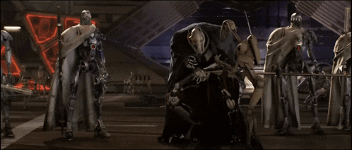

<div align="center">

<!-- ═══════════════ BANNER GIF ═══════════════ -->


<!-- ═══════════════ HEADER ═══════════════ -->


<p>
  <a href="https://kefas.my.id"></a>
  <a href="https://www.linkedin.com/in/kefas-jonathan/"></a>
  <a href="mailto:kefasj@gmail.com"></a>
  
</p>

</div>

---

##  About Me

```yaml
name:      Kefas Jonathan
role:      Product Designer @ Inkubator IT
           Software Engineering Lab Assistant @ STEI ITB
studying:  B.Eng Informatics — Institut Teknologi Bandung (2023 – 2027)
focus:     [ Software Engineering, Product Design, AI, Data-Driven Systems ]
motto:     "Turning ideas into experiences."
```

- 🔭 Currently building things at **Inkubator IT** and assisting the **Software Engineering Lab** at STEI ITB
- 🌱 Exploring **Artificial Intelligence** and **Data-Driven Systems**
- 🎨 I live in the overlap between **engineering** and **design** — I write the code *and* draw the pixels
- 🏆 CIMB Niaga Scholarship Awardee 2025 · BizzIT COMPFEST UI Finalist 2025
- 💬 Ask me about **Next.js, TypeScript, product design, or Star Wars**
- ⚡ Fun fact: *the ability to ship is insignificant next to the power of a good UX*

---

## 🛠️ Tech Stack

<div align="center">

### Languages


### Frontend & Design


### Database & Tools


</div>

---

## 📊 GitHub Stats

<div align="center">


</div>

---

## 🎧 Now Playing

<div align="center">

<a href="https://open.spotify.com/user/hgnhao">
  
</a>

</div>

---

## 🎬 Recently Watched

<div align="center">

<a href="https://letterboxd.com/hgnhao/">
  
</a>

<sub>📽️ Auto-updated from my <a href="https://letterboxd.com/hgnhao/">Letterboxd</a> diary</sub>

</div>

---

## 🤝 Let's Connect

<div align="center">

<a href="https://kefas.my.id"></a>
<a href="https://www.linkedin.com/in/kefas-jonathan/"></a>
<a href="mailto:kefasj@gmail.com"></a>
<a href="https://github.com/hgnhao"></a>
<a href="https://open.spotify.com/user/hgnhao"></a>
<a href="https://letterboxd.com/hgnhao/"></a>

<br><br>


</div>
